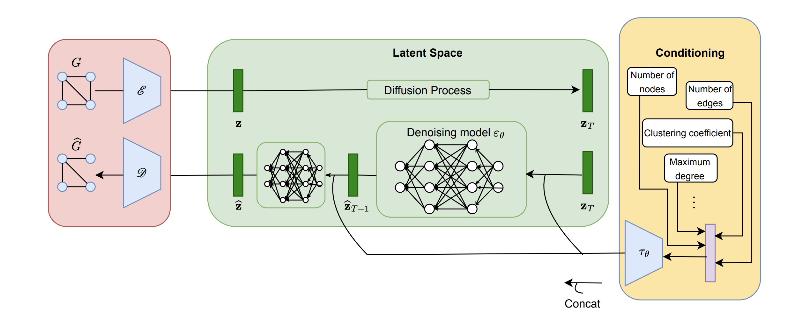

# ALTEGRAD project

Our code for the Generating Graphs with Specified Properties [kaggle challenge](https://www.kaggle.com/competitions/generating-graphs-with-specified-properties).

### Objective

The goal of this project is to explore and apply machine learning/artificial intelligence techniques to generate graphs with specific properties.

For example from the following sentence, 
"graph_0,This graph comprises 50 nodes and 589 edges. The average degree is equal to 23.56 and there are 3702 triangles in the graph. The global clustering coefficient and the graph's maximum k-core are 0.6226034308779012 and 18 respectively. The graph consists of 3 communities.
",
we want to generate a graph that respect these properties.

### Model 
The global architecture of our model is the same as in the ["Neural Graph Generator"](https://arxiv.org/abs/2403.01535) paper:

The global architecture is the following: a variational graph autoencoder is responsible for generating a compressed latent representation z for each graph G. Those representations
are fed to the diffusion model which operates in that latent space adding noise to z resulting
to $z_T$ . The denoising process is conditioned on the encoding of the vector that
contains the graph’s properties. Then, the output of the diffusion model is passed on to the decoder
which generates a graph.

### Projet structure:

    ├── autoencoder.py                   # graph VAE architecture
    ├── bert_text_encoder.py             # bert sentence encoding
    ├── clip_text_encoder.py             # clip sentence encoding  
    ├── compute_MAE.py                   # file to compute the MAE between the properties of the generated graphs (output.csv) \
                                            and the ground truth properties (ground_truth.json)
    ├── denoise_model.py                 # Conditional denoising model
    ├── extract_feats.py                 # Extract conditional properties in the graph text description
    ├── ground_truth.json                # ground truth properties of the test set
    ├── main.py                          # training and inference
    ├── README.md
    ├── requirements.txt
    └── utils.py                         # data preprocessing and some utils functions

### Training / Generate graphs

run `python main.py` to execute the model with the default properties extraction (numbers extraction in the text graph description)

run `python main.py --text-embedding-method "clip_text_encoder" --n-condition 512` to execute the model with an embedding of the graph text description done with a clip text encoder (512 is the dimension of the text embedding).

run `python main.py --text-embedding-method "bert_text_encoder" --n-condition 768` to execute the model with an embedding of the graph text description done with a bert text encoder (768 is the dimension of the text embedding).

run `python main.py --text-embedding-method "extract_numbers_and_bert_text_encoder" --n-condition 775` to execute the model with an embedding of the graph text description done with a bert text encoder concatenate to the default properties extraction.

